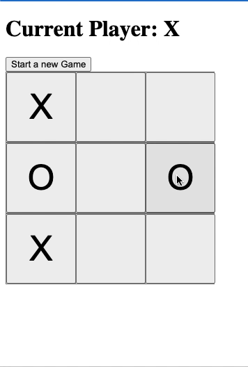

# Angular Tic-Tac-Toe

Welcome to my Angular Tic-Tac-Toe app! This was a small project I made to help me learn Angular which takes inspiration from the React tutorial (making a tic-tac-toe app in React).

The web app is hosted on Firebase and accessible through this link: [https://angular-tic-tac-toe-a1da2.web.app](https://angular-tic-tac-toe-a1da2.web.app)

It is also installable as a PWA and functional on both MacOS and Windows!

